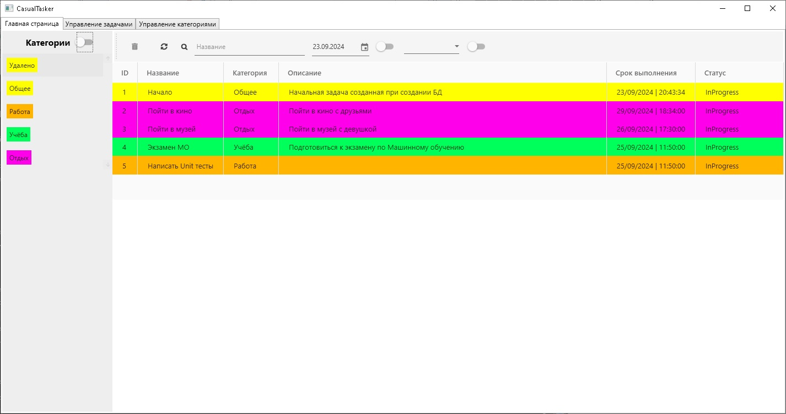
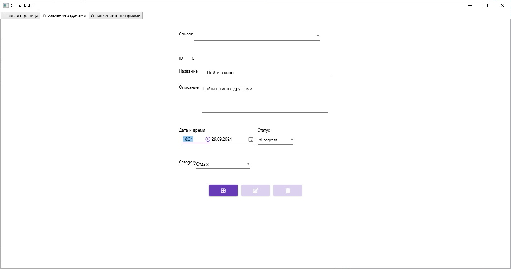
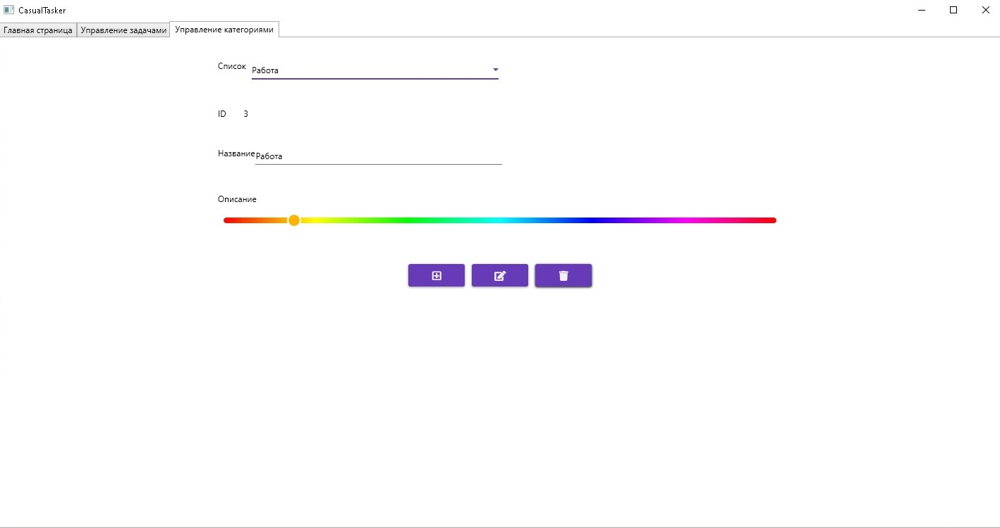

# CasualTasker

**CasualTasker** — это WPF MVVM-приложение для управления повседневными задачами, которое поддерживает категории задач, имеет удобный интерфейс и гибкую архитектуру с использованием принципов SOLID. Приложение интегрировано с базой данных SQLite и предоставляет возможности добавления, обновления и удаления задач и категорий.

## Скриншоты

**Главное окно**

**Окно редактирования задачи**

**Окно редактирования категории**

## Установка и запуск

1. **Скачайте архив** с проектом *Casual Tasker*.
2. **Разархивируйте** содержимое архива в желаемую папку.
3. **Запустите** файл `CasualTasker.exe`.

## Документация
Чтобы ознакомится с документацией перейдите по [ссылке](https://german322vdk.github.io/CasualTasker/)

## Особенности проекта

- Архитектура **MVVM (Model-View-ViewModel)** для разделения представления и логики.
- **Entity Framework Core** для взаимодействия с базой данных SQLite.
- Использование **ObservableCollection** для автоматического обновления пользовательского интерфейса при изменении данных.
- **Serilog** для логгирования работы приложения.
- **Unit-тесты** для проверки бизнес-логики с использованием `xUnit` и `Moq`.
- Поддержка **CategoryFallbackService** для работы с удалёнными категориями.
- Настройки приложения хранятся в формате **appsettings.json** для легкой настройки путей логов и параметров базы данных.

## Используемые технологии
- **WPF (Windows Presentation Foundation)**: используется для построения UI.
- **MVVM (Model-View-ViewModel)**: шаблон проектирования, обеспечивающий разделение логики представления и данных.
- **SQLite**: локальная база данных для хранения задач и категорий.
- **Entity Framework Core**: ORM для взаимодействия с базой данных.
- **Serilog**: библиотека для логирования.
- **xUnit**: фреймворк для модульного тестирования.
- **FontAwesome5**: библиотека иконок
- **MaterialDesignThemes**: библиотека, которая предоставляет стили и контролы от Google

## Архитектура

### Основные классы:

- **ObservableDbCollection<TEntity>** — это обобщённый класс, который служит связующим звеном между данными в базе данных и пользовательским интерфейсом (представлением). Он вызывает соответствующие методы из класса **DbStore** для операций добавления, удаления и обновления данных и вызывает **ViewUpdater** для синхронизации и обновления пользовательского интерфейса, чтобы изменения в данных отображались в представлении.
- **DbStore<TEntity>, CategoryStore и TaskStore** - классы хранилищ, которые работают напрямую с базой данных. Каждый Store управляет CRUD операциями для конткретной сущностьи
- **ViewUpdater<TEntity>** — отвечает за обновление представления с использованием `ObservableCollection` и `ICollectionView`.
- **CategoryDTO и TaskDTO** — классы данных для категорий и задач.
- **CategoryFallbackService** — сервис, обрабатывающий задачи, связанные с удалёнными категориями, чтобы назначить их в fallback категорию.
  
### Тестирование:

Тесты охватывают основные сценарии работы с коллекциями задач и категорий, включая операции добавления, удаления и обновления. Тесты охватывают классы **CategoryStore и TaskStore** и **ObservableDataCollection<TEntity>**.
- Тестирование логики CRUD классов TaskStore и CategoryStore функций: Add Delete Update
- Тестирование связующих UI и DB классов ObservableCategoryDbCollection и ObservableCategoryDbCollectionTests функций: Add Delete Update
**Покрытие кода:**
- Бизнес-логика (CategoryStore, TaskStore) — 87,3%.
- UI и база данных (ObservableDbCollection) — 65,5%.
- общее — 68,6%

### Требования:

- **.NET 8.0 SDK**
- **SQLite** — для локальной базы данных

## Вклад

Этот проект разрабатывается как инструмент для управления повседневными задачами. Если у вас есть идеи по улучшению приложения или вы хотите внести свой вклад, мы приветствуем Pull Requests и Issues. Вместе мы можем сделать CasualTasker лучше.

